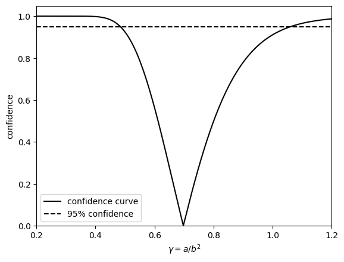

$\newcommand{\hdr}[4]{\color{#2}\boxed{\color{#2}\ #1\ \mid\ \textcolor{black}{#3} #4\ }\color{black}\ }$

$\newcommand{\defn}[1]{\hdr{D}{##fdc086}{#1}{}}$
$\newcommand{\defnn}[2]{\hdr{D}{##fdc086}{#1}{\ \mid\ \textcolor{black}{#2}}}$
$\newcommand{\thm}[1]{\hdr{T}{##7fc97f}{#1}{}}$
$\newcommand{\ex}[1]{\hdr{E}{##ae9ed4}{#1}{}}$
$\newcommand{\danger}[1]{\hdr{\textbf{☡}}{##cc0000}{#1}{\textcolor{##cc0000}{\mid \textbf{☡}}}}$
$\newcommand{\wip}[1]{\hdr{\textbf{🚧}}{##fcd100}{#1}{\textcolor{##fcb100}{\mid \textbf{🚧}}}}$

$\renewcommand{\P}{\mathbb{P}}$
$\newcommand{\E}{\mathbb{E}}$
$\newcommand{\V}{\mathbb{V}}$
$\newcommand{\R}{\mathbb{R}}$
$\renewcommand{\|}{|}$
$\newcommand{\norm}[1]{\mathcal{N}(#1)}$
$\newcommand{\tr}{\operatorname{tr}}$

$\newcommand{\iidsim}{\overset{\mathrm{i.i.d.}}{\sim}}$

$\newcommand{\deldel}[1]{\frac{\partial}{\partial #1}}$

$\newcommand{\distconv}{\overset{d}{\rightarrow}}$

# III: Wilks' teorem, konfidensintervaller, konfidenskurver

Vi oppsummerer noen egenskaper ved MLE:

La $X_1, \dots, X_n \iidsim f_X(x;\theta)$, $\theta \in \R^p$

1. $\sqrt{n}(\hat\theta - \theta)\overset{d}{\rightarrow} \mathcal{N}(0, \mathcal{I}(\theta)^{-1})$
2. Gitt 1, har vi $\sqrt{n}(h(\hat\theta)-h(\theta))\overset{d}{\rightarrow} \mathcal{N}(0, \nabla h(\theta)^T \mathcal{I}(\theta)^{-1} \nabla h (\theta))$

En svakhet ved dette er at dette baseres på en Taylorapproksimasjon. Hvis $n$ er liten, er denne ikke nødvendigvis særlig god.

I tillegg gir det alltid symmetriske konfidensintervaller.

## Profilering, Wilks' teorem og konfidensintervaller

Et universelt bedre alternativ er å bruke Wilks' teorem:

La *fokusparameter* $\gamma=g(\theta) = g(\theta_1, \dots, \theta_p)$

For eksempel kan $\gamma$ være variansen til en gammafordeling eller et kvantil i en normalfordeling.

### Steg 1: profilering

$\defnn{\text{Profilert likelihood}}{\ell_{prof}(\gamma)}= \max\set{\ell(\theta): g(\theta)=\gamma}$

Merk at $\hat\gamma = g(\hat\theta)$ og $\max\limits_\theta \ell(\theta) = \max\limits_\gamma \ell_{prof}(\gamma)$

### Steg 2: deviance function

$D(\gamma) = 2(\ell(\hat\theta)-\ell_{prof}(\gamma))$

### Steg 3: Wilks' teorem

$\defnn{\chi^2\text{-fordeling}}{\chi^2_k}$ $Z_1, \dots, Z_k \iidsim \norm{0,1}\implies \sum\limits_1^k Z_i^2\thicksim\chi^2_k$

$\thm{\text{Wilks}}D(\gamma) \distconv \chi^2_1$

Merk at $\chi^2:1$ er fordelingen til kvadratet av en standardnormalfordelt stokastisk variabel.

### Steg 4: konfidensintervaller

$100p\ \%\ \text{CI} = \set{\gamma: D(\gamma) \leq F^{-1}(p)}$ hvor $F$ er fordelingsfunksjonen til $\chi^2_1$-fordelingen.

Vi tar til slutt for oss et eksempel:

$\ex{\text{Gammafordelingen (igjen)}}$

$\wip{\text{Trenger opprydding}}$

$\ell(a,b) = \sum\limits_1^n{a \log b - \log \Gamma (a) + (a-1)\log y_i - b y_i}
= na\log b - n \log \Gamma(a) + (a-1) \sum\limits_1^n \ log (y_i) - b \sum_1^n y_i$

Vi profilerer:  $g(a,b) = \frac{a}{b^2}$

$\ell_{prof} (\gamma) = \max \set{\ell(a,b): \frac{a}{b^2}=\gamma} = \max\set{\ell(a,b):a=\gamma b^2}$

$\max\limits_b n_b^2\ \gamma \log b - n \log \Gamma(b^2)\gamma + (b^2 \gamma -1 ) \sum_1^n \log y_1 - b \sum_1^n y_1$

De resulterende konfidensintervallene vises i [kodeeksempelet](https://colab.research.google.com/drive/1u_O0u2BH_1gJ7gvdWT3m2PsDXAQAmf5X?usp=sharing).

## Konfidenskurver

Intuisjonssjekk: $\ex{\text{Hvor stort er et }100\ \% \text{ konfidensintervall? Hva representerer et } 0\ \%\text{ konfidensintervall ?}}$

Det er temmelig vilkårlig at vi nesten alltid velger 95 %-konfidensnivået. Hvorfor ikke 90 % eller 99 %? Hvorfor ikke se på *alle* mulige konfidensnivåer?

$\defnn{\text{Konfidenskurve}}{cc}\text{cc}(\gamma) = F(D(\gamma))$

<iframe src="https://docs.google.com/forms/d/e/1FAIpQLScyF8YFFvS9C_m7fGVgf47wZaJS75MEBUb1SB7dGLRiCwK13w/viewform?embedded=true" width="640" height="553" frameborder="0" marginheight="0" marginwidth="0">Loading…</iframe>